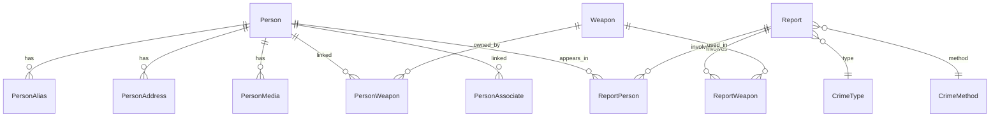

# 01 — نظرة عامة على النظام

## 1. الهدف

نظام داخلي لإدارة **قاعدة بيانات المسجلين خطر** يتيح:

1. تسجيل وإدارة ملفات الأشخاص (زائر / مسجّل A / مسجّل B)
2. كتابة محاضر الحوادث مع **اقتراح تلقائي** للأشخاص والأسلحة
3. بحث متقدم وسجل تدقيق كامل
4. صلاحيات متدرجة (Admin / Moderator / User)

---

## 2. المستخدمون

| الدور | الوصف |
|-------|-------|
| **Admin** | إدارة كاملة — مستخدمين — إعدادات — تصدير |
| **Moderator** | إنشاء/تعديل/اعتماد المسجّلين والمحاضر |
| **User** | بحث وعرض — تقديم بلاغات (اختياري) |

---

## 3. الكيانات الرئيسية



---

## 4. تدفق العمل الرئيسي

### 4.1 إضافة مسجّل جديد

```
بلاغ/محضر → زائر (بيانات محدودة)
           → مراجعة Moderator
           → ترقية لمسجّل A أو B (ملف كامل)
           → اعتماد → يظهر في البحث والاقتراحات
```

### 4.2 كتابة محضر

```
إدخال: أسلوب الجريمة + المكان + الزمان
      → محرك اقتراح
      → أشخاص + أسلحة مقترحة
      → اختيار / إضافة يدوي
      → حفظ → يُغذّي قاعدة الاقتراحات مستقبلاً
```

---

## 5. المتطلبات غير الوظيفية

| المتطلب | التفاصيل |
|---------|----------|
| اللغة | عربي RTL — واجهة كاملة |
| الأمان | RBAC + Audit Log + تشفير حقول حساسة |
| الأداء | بحث < 2 ثانية لـ 100K سجل |
| التوفر | شبكة داخلية (Intranet) |
| النسخ الاحتياطي | يومي مشفّر |
| الحذف | Soft delete فقط — لا حذف نهائي |

---

## 6. التقنيات المقترحة

| الطبقة | التقنية |
|--------|---------|
| Backend | Laravel 12 |
| Admin UI | Filament 3 |
| Auth | Laravel Breeze + 2FA (لاحقاً) |
| Permissions | spatie/laravel-permission |
| Audit | spatie/laravel-activitylog |
| Media | spatie/laravel-medialibrary |
| Search | Laravel Scout + Meilisearch |
| DB | MySQL 8 |

---

## 7. الملفات المرجعية

- أنواع المسجّل → [02-person-types.md](02-person-types.md)
- الوصف الكامل → [03-person-profile.md](03-person-profile.md)
- المحاضر والاقتراحات → [04-reports-and-suggestions.md](04-reports-and-suggestions.md)
- الصلاحيات → [05-roles-and-permissions.md](05-roles-and-permissions.md)
- قاعدة البيانات → [06-database-schema.md](06-database-schema.md)
- خطة التنفيذ → [07-development-phases.md](07-development-phases.md)
