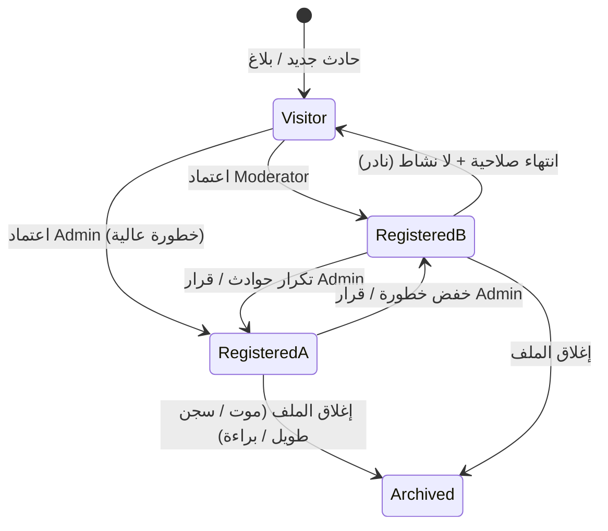

# 02 — أنواع المسجّل

## 1. التصنيفات الثلاثة

```
person_type ENUM:
  visitor      → زائر
  registered_a → مسجّل A
  registered_b → مسجّل B
```

---

## 2. تعريف كل نوع

### 2.1 زائر (Visitor)

| البند | التفاصيل |
|-------|----------|
| **الغرض** | تسجيل شخص ظهر في حادث أو بلاغ دون وجود ملف دائم سابق |
| **مدة الصلاحية** | مؤقت — يُراجع خلال 30 يوماً (قابل للتعديل) |
| **الحقول المتاحة** | مجموعة محدودة (انظر القسم 4) |
| **الظهور في البحث** | نعم — مع تمييز بصري "زائر" |
| **التحويل** | يمكن ترقيته إلى مسجّل A أو B بموافقة Moderator+ |
| **الحذف** | Soft delete فقط — لا حذف نهائي |

**متى يُنشأ زائر؟**
- أول ظهور للشخص في محضر
- بلاغ من User لم يُربط بمسجّل موجود
- اقتراح من النظام لم يُؤكَّد بعد

---

### 2.2 مسجّل A (Registered A)

| البند | التفاصيل |
|-------|----------|
| **الغرض** | ملف دائم لشخص خطر / مطلوب / متكرر الإجرام |
| **الأولوية** | عالية — يظهر أولاً في نتائج البحث والاقتراحات |
| **الحقول المتاحة** | **الملف الكامل** — كل الحقول في [03-person-profile.md](03-person-profile.md) |
| **المراجعة** | إلزامية عند الإنشاء — Moderator يعتمد |
| **التنبيهات** | عند أي محضر جديد يطابق نمطه |
| **مستوى الخطورة** | عادة: عالي أو حرج |

**معايير التصنيف كـ A (أي شرط يكفي):**
- تكرار في حوادث من نفس الأسلوب (≥ 2)
- مطلوب بمذكرة توقيف / قرار قضائي
- تصنيف خطورة: عالي أو حرج
- قرار إداري صريح من Admin

---

### 2.3 مسجّل B (Registered B)

| البند | التفاصيل |
|-------|----------|
| **الغرض** | ملف دائم لمراقبة / متابعة — خطورة أقل من A |
| **الأولوية** | متوسطة |
| **الحقول المتاحة** | **الملف الكامل** — نفس A |
| **المراجعة** | اعتماد Moderator |
| **التنبيهات** | اختيارية |
| **مستوى الخطورة** | عادة: منخفض أو متوسط |

**معايير التصنيف كـ B:**
- حادث واحد مؤكد دون تكرار
- ترقية من زائر بعد مراجعة
- خفض تصنيف من A (بقرار Admin)
- إضافة للقائمة الرقابية دون مطلوبية قضائية

---

## 3. مقارنة سريعة

| الخاصية | زائر | مسجّل A | مسجّل B |
|---------|:----:|:------:|:------:|
| ملف كامل | ❌ | ✅ | ✅ |
| دائم | ❌ | ✅ | ✅ |
| يحتاج اعتماد | ❌ | ✅ | ✅ |
| أولوية بحث | منخفضة | **عالية** | متوسطة |
| أولوية اقتراح في المحضر | منخفضة | **عالية** | متوسطة |
| صلاحية زمنية | 30 يوم | لا محدود | لا محدود |
| ترقية/تحويل | → A أو B | → B (خفض) | → A (رفع) |
| عدد الصور الأقصى | 2 | غير محدود | غير محدود |
| الأسماء المستعارة | 1 | غير محدود | غير محدود |
| ربط أسلحة | ❌ | ✅ | ✅ |
| ربط علاقات | ❌ | ✅ | ✅ |

---

## 4. الحقول المتاحة حسب النوع

### زائر — الحقول الإلزامية فقط

```
✅ full_name
✅ gender
✅ approximate_age | birth_date
✅ nationality
✅ physical_description (نص حر مختصر)
✅ distinguishing_marks (علامات مميزة)
✅ photo (صورة واحدة على الأقل إن وُجدت)
✅ incident_context (من أي محضر/حادث أُضيف)
✅ notes
```

### زائر — حقول اختيارية

```
⚪ national_id
⚪ phone
⚪ last_known_address (عنوان واحد)
⚪ clothing_description (وصف الملابس وقت الحادث)
```

### مسجّل A / B — كل الحقول

انظر [03-person-profile.md](03-person-profile.md) — **بدون استثناء**.

---

## 5. قواعد التحويل (Promotion / Demotion)



### سجل التحويل `person_type_history`

| الحقل | النوع | الوصف |
|-------|-------|-------|
| person_id | FK | المسجّل |
| from_type | enum | النوع السابق |
| to_type | enum | النوع الجديد |
| reason | text | سبب التحويل |
| changed_by | FK users | من نفّذ |
| changed_at | timestamp | وقت التحويل |

---

## 6. الحالة الإدارية (مستقلة عن النوع)

```
status ENUM (لكل مسجّل):
  draft        → مسودة (لم يُعتمد)
  active       → نشط
  wanted       → مطلوب
  detained     → موقوف / محتجز
  archived     → مؤرشف / مغلق
```

> **النوع** (زائر/A/B) يحدد **عمق الملف وأولوية الظهور**  
> **الحالة** تحدد **الوضع القانوني/التشغيلي الحالي**

---

## 7. قواعد العرض في الواجهة

| النوع | اللون/الشارة | في قائمة البحث | في اقتراح المحضر |
|-------|-------------|---------------|-----------------|
| زائر | 🟡 أصفر | نعم — آخر القائمة | وزن 0.5× |
| مسجّل B | 🟠 برتقالي | نعم | وزن 0.8× |
| مسجّل A | 🔴 أحمر | **أول القائمة** | وزن 1.0× |
