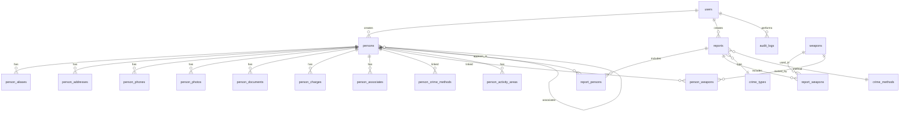

# 05 — مخطط قاعدة البيانات

## 5.1 مخطط العلاقات



## 5.2 الجداول الرئيسية

### `persons` — السجل الرئيسي

```sql
persons
├── id                    BIGINT PK
├── registration_number   VARCHAR UNIQUE    -- V-2026-0042 / A-2026-0001
├── registration_type     ENUM(visitor, registered_a, registered_b)
├── full_name             VARCHAR
├── full_name_ar          VARCHAR NULL
├── national_id           VARCHAR NULL INDEX
├── passport_number       VARCHAR NULL INDEX
├── passport_country      VARCHAR NULL
├── nationality           VARCHAR
├── second_nationality      VARCHAR NULL
├── birth_date            DATE NULL
├── birth_place           VARCHAR NULL
├── gender                ENUM(male, female)
├── marital_status        VARCHAR NULL
├── height_cm             SMALLINT NULL
├── weight_kg             SMALLINT NULL
├── build                 VARCHAR NULL
├── skin_color            VARCHAR NULL
├── eye_color             VARCHAR NULL
├── hair_color            VARCHAR NULL
├── hair_style            VARCHAR NULL
├── facial_hair           VARCHAR NULL
├── distinguishing_marks  TEXT NULL
├── physical_description  TEXT NULL
├── risk_level            ENUM(low, medium, high, critical) NULL
├── legal_status          ENUM(wanted, under_surveillance, detained, released, cleared) NULL
├── modus_operandi        TEXT NULL
├── criminal_history      TEXT NULL
├── gang_affiliation      VARCHAR NULL
├── warrant_number        VARCHAR NULL
├── warrant_date          DATE NULL
├── visa_type             VARCHAR NULL        -- زائر
├── visa_expiry           DATE NULL
├── entry_date            DATE NULL
├── expected_departure    DATE NULL
├── hotel_accommodation   VARCHAR NULL
├── workplace             VARCHAR NULL
├── occupation            VARCHAR NULL
├── preferred_time_of_day VARCHAR NULL
├── last_known_activity   DATETIME NULL
├── last_seen_location    VARCHAR NULL
├── status                ENUM(draft, active, archived, closed)
├── is_published          BOOLEAN DEFAULT false
├── internal_notes        TEXT NULL
├── source_of_information VARCHAR NULL
├── confidence_level      ENUM(low, medium, high) NULL
├── created_by            FK → users
├── approved_by           FK → users NULL
├── approved_at           DATETIME NULL
├── reviewed_at           DATETIME NULL
├── next_review_at        DATE NULL
├── created_at / updated_at / deleted_at
```

### `person_aliases`

```sql
person_aliases
├── id, person_id FK
├── alias                   VARCHAR
├── alias_type              ENUM(nickname, fake_name, maiden_name, other)
```

### `person_addresses`

```sql
person_addresses
├── id, person_id FK
├── type                    ENUM(home, work, temporary, known_previous)
├── governorate, district, street, building
├── latitude, longitude     DECIMAL NULL
├── is_current              BOOLEAN
```

### `person_photos`

```sql
person_photos
├── id, person_id FK
├── path, type, taken_at, source
├── is_primary              BOOLEAN
├── is_restricted           BOOLEAN DEFAULT false
```

### `person_charges`

```sql
person_charges
├── id, person_id FK
├── charge_type, charge_date
├── court, case_number
├── status                  ENUM(pending, convicted, acquitted)
```

### `person_associates`

```sql
person_associates
├── id
├── person_id               FK → persons
├── associate_id            FK → persons
├── relation_type           ENUM(partner, client, relative, gang_member, other)
├── notes                   TEXT NULL
```

### `person_weapons` (ربط شخص بسلاح)

```sql
person_weapons
├── person_id, weapon_id
├── notes
```

### `weapons`

```sql
weapons
├── id
├── type                    VARCHAR    -- مسدس، سكين، ...
├── caliber                 VARCHAR NULL
├── description             TEXT NULL
├── serial_number           VARCHAR NULL
```

### `crime_types` — أنواع الجريمة

```sql
crime_types
├── id, name, name_ar, is_active
```

### `crime_methods` — أساليب الجريمة

```sql
crime_methods
├── id, name, name_ar
├── crime_type_id           FK NULL
├── is_active
```

### `reports` — المحاضر

```sql
reports
├── id
├── report_number           VARCHAR UNIQUE
├── crime_type_id           FK
├── crime_method_id         FK
├── occurred_at             DATETIME
├── governorate, district
├── location_text           TEXT NULL
├── latitude, longitude     DECIMAL NULL
├── description             TEXT
├── status                  ENUM(draft, pending_review, approved, archived)
├── created_by, reviewed_by, approved_by  FK → users
├── created_at / updated_at / deleted_at
```

### `report_persons`

```sql
report_persons
├── report_id, person_id
├── role                    ENUM(suspect, witness, victim)
├── source                  ENUM(suggested, manual)
├── confidence_score        TINYINT NULL
├── suggestion_reason       TEXT NULL
├── is_confirmed            BOOLEAN DEFAULT false
```

### `report_weapons`

```sql
report_weapons
├── report_id, weapon_id
├── source, confidence_score
├── is_confirmed            BOOLEAN DEFAULT false
```

### `audit_logs`

```sql
audit_logs
├── id, user_id FK
├── action                  VARCHAR    -- view, create, update, delete, search, export
├── auditable_type, auditable_id   -- polymorphic
├── old_values, new_values  JSON NULL
├── ip_address, user_agent
├── created_at
```

## 5.3 جداول مساعدة (Lookups)

| الجدول | الغرض |
|--------|-------|
| `governorates` | المحافظات |
| `districts` | الأحياء/المراكز |
| `risk_levels` | مستويات الخطورة (قابلة للتخصيص) |
| `legal_statuses` | الحالات القانونية |
| `charge_types` | أنواع التهم |
| `weapon_types` | أنواع الأسلحة |

## 5.4 ترقيم التسجيل التلقائي

| النوع | البادئة | مثال |
|-------|---------|------|
| زائر | `V-` | `V-2026-0042` |
| مسجل A | `A-` | `A-2026-0001` |
| مسجل B | `B-` | `B-2026-0015` |
| محضر | `R-` | `R-2026-00001` |

## 5.5 الفهارس المقترحة (Indexes)

```sql
INDEX persons_registration_type
INDEX persons_national_id
INDEX persons_passport_number
INDEX persons_nationality
INDEX persons_risk_level
INDEX persons_status_is_published
INDEX reports_crime_method_occurred_at
INDEX reports_governorate_district
INDEX report_persons_person_id
INDEX audit_logs_user_created
```
